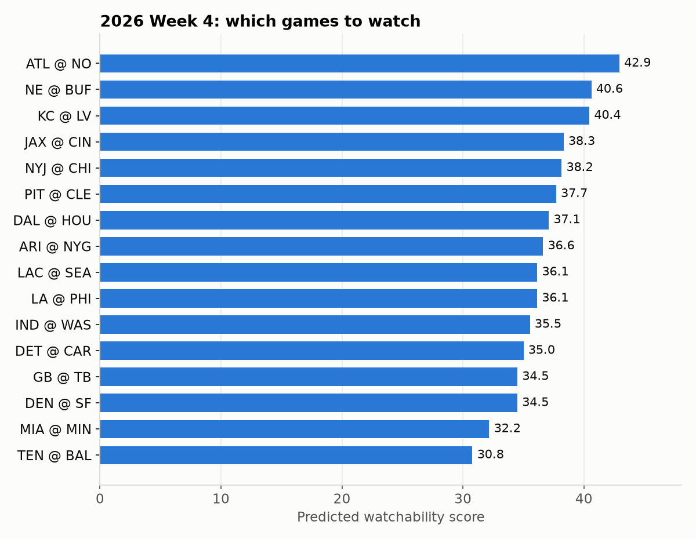
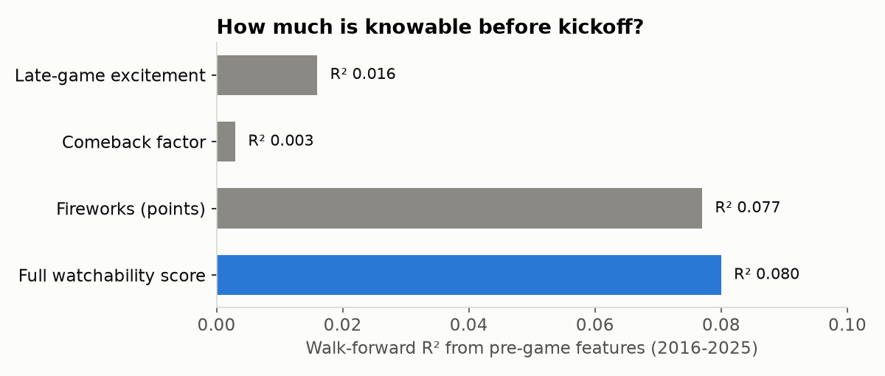
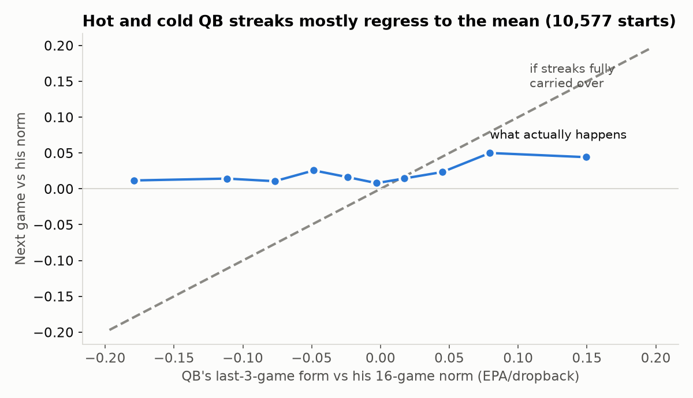

# Which NFL Game Should I Watch?

A machine-learning model that ranks each week's NFL games by how **worth watching** they are likely to be, and explains why in plain English.

I built this as a hands-on project while working through an AI/ML engineering curriculum, covering linear algebra, optimization, statistics, classical ML, ensembles and validation. Every modeling decision here comes from a concept I was learning at the time, tested on real data rather than taken on faith. It's also something I actually use: every Sunday it tells me which games to put on.



## This week: 2026 Week 4

| # | Game | Kickoff (ET) | Score | Why |
|---|------|-------------|------:|-----|
| 1 | ATL @ NO | Mon 20:15 | 42.9 | division rivals; Vegas calls it a coin flip (2.5-pt spread) |
| 2 | NE @ BUF | Sun 13:00 | 40.6 | division rivals; shootout expected (O/U 48.5); top QB Josh Allen; but likely lopsided (7-pt favorite) |
| 3 | KC @ LV | Sun 16:25 | 40.4 | division rivals; top QB Patrick Mahomes; two winning teams |
| 4 | JAX @ CIN | Sun 13:00 | 38.3 | coin flip (2.5-pt spread); shootout expected (O/U 50.5); top QB Joe Burrow; two winning teams |
| 5 | NYJ @ CHI | Sun 13:00 | 38.2 | Geno Smith on a heater |
| 6 | PIT @ CLE | Thu 20:15 | 37.7 | division rivals; coin flip (2.5-pt spread); two winning teams; Deshaun Watson on a heater |
| 7 | DAL @ HOU | Sun 13:00 | 37.1 | coin flip (2.5-pt spread); top QB Dak Prescott |
| 8 | ARI @ NYG | Sun 13:00 | 36.6 | coin flip (1.5-pt spread) |
| 9 | LAC @ SEA | Sun 16:25 | 36.1 | nothing stands out |
| 10 | LA @ PHI | Sun 13:00 | 36.1 | coin flip (2.5-pt spread); top QB Matthew Stafford |
| 11 | IND @ WAS | Sun 09:30 | 35.5 | Daniel Jones in a slump |
| 12 | DET @ CAR | Sun 20:20 | 35.0 | shootout expected (O/U 49.5); top QB Jared Goff |
| 13 | GB @ TB | Sun 13:00 | 34.5 | top QB Jordan Love; Love and Baker Mayfield both in a slump |
| 14 | DEN @ SF | Sun 16:25 | 34.5 | top QB Brock Purdy; two winning teams; Bo Nix in a slump; Purdy on a heater |
| 15 | MIA @ MIN | Sun 16:05 | 32.2 | Kyler Murray in a slump; but likely lopsided (10.5-pt favorite) |
| 16 | TEN @ BAL | Sun 13:00 | 30.8 | likely lopsided (11.5-pt favorite) |

## How it works

**1. Define "watchable" from play-by-play data (the label).** There's no official "watchability" number, so I built one. It covers roughly 7,000 completed games from 2000–2025 and uses nflverse play-by-play data. The label blends five signals:

| Signal | Weight | What it measures |
|---|---:|---|
| Late-game excitement | 0.335 | win-probability swings, weighted toward the 4th quarter |
| Playoff stakes | 0.275 | regular season → Super Bowl |
| Comeback factor | 0.17 | how close the eventual winner came to losing |
| Fireworks | 0.17 | total points |
| Rivalry | 0.05 | division game |

Each signal is **percentile-ranked** before blending. An earlier version used z-scores, which turned *rarity* into *magnitude*: a 13–3 Super Bowl outscored every regular-season thriller ever played. I checked the label against games whose reputation is settled. The 28–3 Super Bowl LI comeback ranks well above the 13–3 Super Bowl LIII.

**2. Predict it from pre-game information only.** The features are Vegas spread and over/under, team form (rolling stats over each team's previous 8 games, using `shift(1)` so a game never sees its own result), win percentages, playoff stakes, division game, primetime slot, rest days, roof and weather. Preprocessing lives inside a scikit-learn `Pipeline`/`ColumnTransformer`, so imputation and scaling are fit on training data only. A dedicated test checks for leakage.

**3. Validate like it's the future.** NFL data is ordered in time and team quality drifts, so random train/test splits are invalid here. Every result uses **walk-forward validation**: train on all seasons before year *Y*, test on *Y*, for 2016–2025.

| Model | RMSE | R² | Within-week rank correlation |
|---|---:|---:|---:|
| Predict the mean (floor) | 14.95 | 0.000 | 0.00 |
| **Ridge regression** | **14.33** | **0.077** | **0.19** |
| LightGBM | 14.35 | 0.075 | 0.17 |

Ridge ties gradient boosting, so I shipped Ridge. It's simpler, and because it's linear every prediction breaks down exactly into per-feature contributions (`--explain`).

**4. Explain it in plain English.** The "Why" column comes from pre-game facts: coin-flip spreads, expected shootouts, top QBs (ranked by shrunk EPA per dropback), and hot or cold QB streaks.

## Findings

**Most of what makes a game great can't be known before kickoff.** Whether a game turns into a comeback or a last-second finish is close to unpredictable. The model mostly wins by spotting expected shootouts and avoiding likely blowouts. An R² of 0.08 sounds low, but it's close to the ceiling for this problem, not a bug.



**Hot and cold QB streaks mostly regress to the mean.** After watching a QB struggle through a cold stretch, I tested whether a QB's last 3 games predict his next one better than his longer track record. Across 10,577 starts, only **about 9%** of a streak carries into the next game. Adding streaks to the model left walk-forward R² unchanged, because Vegas lines already react to them. Streaks now show up in the "Why" column as context but don't move the score.



**Other lessons from the data:**
- **Question the assumptions baked into the label.** Division games turned out to be no more dramatic than other games, so a big rivalry weight was a free bonus rather than a real signal. I cut it from 0.15 to 0.05.
- **Leaky labels inflate scores.** An early version reached R² 0.25 only because a pre-game feature (division game) was copied straight into the label.
- **Column semantics matter.** Three consecutive bugs came from nflverse fields that don't mean what they look like: `wp` flips every possession, and `home_score` is the *final* score on every row. Each was caught by checking famous games, not summary stats.

## Project structure

```
src/
  build_label.py      watchability label (percentile-blended signals)
  drama_features.py   excitement / comeback / fireworks from play-by-play
  features.py         pre-game features, team form, QB quality and streaks
  rank_week.py        train, rank a week, write plain-English reasons
  make_charts.py      README charts
notebooks/            01 data & labels · 02 features & model comparison · 03 weekly ranking
tests/                label, drama, leakage, explanations, ratings file
```

## What's next

A **retrieval-augmented (RAG) layer**: pull recent news, injury reports and storylines for the top-ranked games and have an LLM write a short, grounded "why watch this" blurb for each.

---

*Stack: Python, pandas, scikit-learn, LightGBM, matplotlib, nfl_data_py (nflverse). Built with AI pair-programming (Claude Code) as part of learning ML engineering. The design decisions and experiments are mine to defend.*
